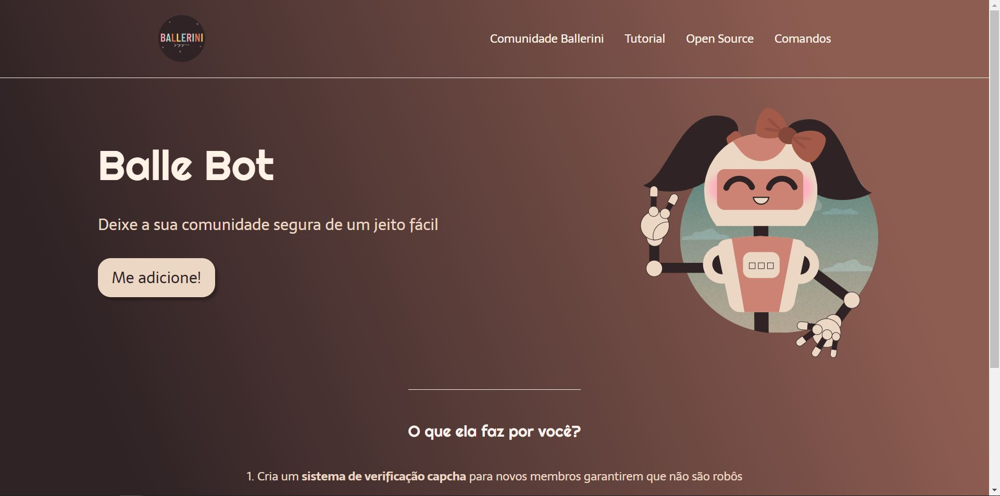

# Balle Bot Landing Page 

Esse é um projeto desenvolvido pela Rafaella Ballerini, em seu canal do YouTube. O projeto é uma landing page para um robô - Balle Bot - que modera a comunidade da Youtuber no Discord.

# Projeto

O projeto foi construído utilizando HTML, CSS, Flexbox e o Figma para desenvolvimento do design da page. Foi importante para me ajudar a esquematizar e organizar o projeto antes mesmo de começar a codar, algo que eu tinha dificuldade.

- Github: [Thamyris Szymanski](https://github.com/thamyrix)

- Live Site URL: [Balle Bot](https://thamyrix-landing-page-ballebot.netlify.app/)

  
